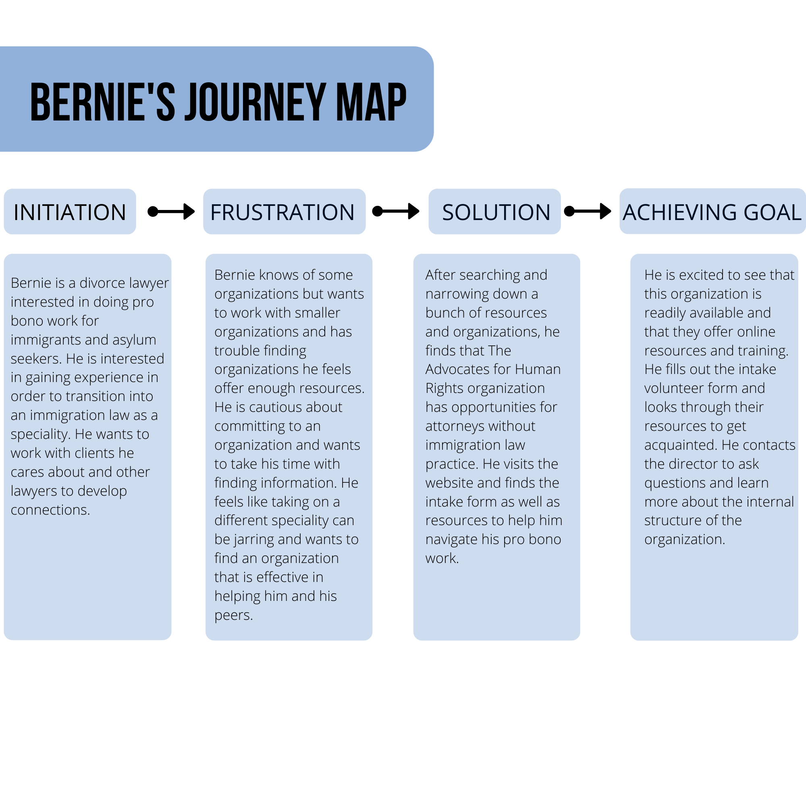
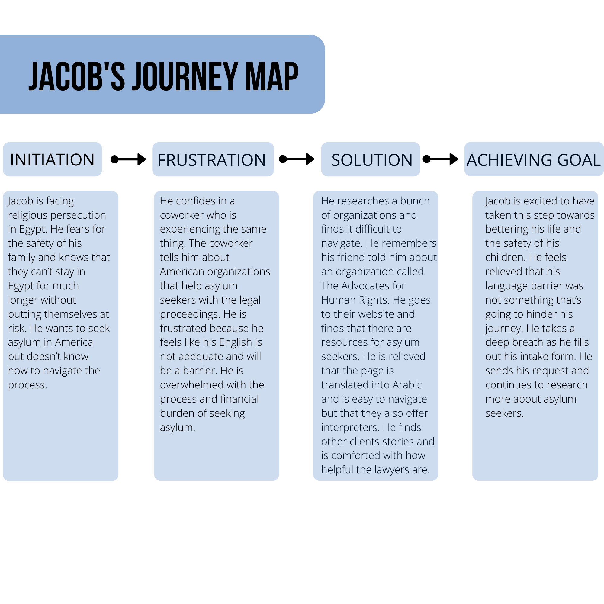
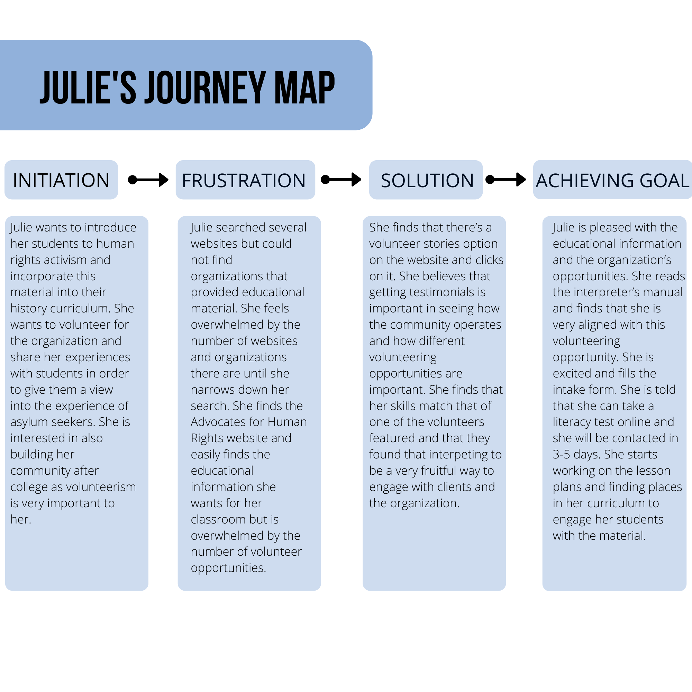

# DH 150: Assignment 5 
# The Advocates for Human Rights User Persona and Cases by Marina Souliman 

## UX Storytelling
Insert paragraph 

## Persona and Empathy Maps 

## Bernie 

## Jacob
 

## Julie 

## Scenarios and Journey Maps 
### Scenario 1 
Bernie is a divorce lawyer who is trying to find pro bono opportunities in immigration law as he wants to transition to that specialization. He is passionate about immigration rights and wants to volunteer at a non-profit helping connect lawyers and clients. He is looking for information about the process as well as the experience from lawyers who have worked with the organization. Bernie is not in a rush to explore his options and would rather take his time. It’s very important to him that he feels like he will be able to make an impact with the help of the organization. 

User case: Bernie opens up The Advocates for Human Rights website and scrolls for a little bit. He is unsure where the  opportunity for attorneys would be. He finds the volunteer tab and realizes the attorneys page is also under the volunteering tab. He is searching for attorney related positions and finds an overall landing page titled “Attorney Volunteer Opportunity.” He clicks on it and sees that there are two different types of representation he can look into: Asylum Attorneys and Bond Representation Attorneys. He reads about the information and finds that he wants to work as an Asylum Attorney. He sees there is a contact page for the coordinator if he has any questions and he makes note of it. Interested in what resources are offered, Bernie clicks on the resources tab and sees that they offer a variety of training resources. He is satisfied with the resources provided. He fills in the volunteer form and submits it to the website.

### Scenario 2 
Jacob is a Christian mechanical engineer from Egypt. He is active in his church and is very well known in the community as a Christian leader. He and his family have been targeted and discriminated against due to Jacob’s involvement with their church and their religious background. He is concerned for his family’s safety and wants to seek asylum in America. He hears from his coworker who is also facing discrimination about American organizations who help people with their asylum cases. He decides to research some of these organizations. 

User case: Jacob sits down at his computer after work and translates the words “asylum seeker legal counsel” from Arabic to English. He finds a bunch of organizations and is slightly overwhelmed by the language barrier but remembers his friend recommended The Advocates for Human Rights website. He googles the organization and finds their website. It’s in English but he sees an option labeled “Asylum Seekers.” He clicks on the link and is relieved to see that there’s an Arabic translation option for the page. The page has the options free legal services, detainee information, asylum FAQ, client stories and an intake form. He reads the asylum FAQ and learns about the different asylum cases. He reads clients' stories and finds people gained asylum for religious persecution. He decides to fill in the intake form and is told he will be contacted in the next 3 weeks with information. He is relieved that he has taken this important step. 

### Scenario #3 
Julie is a recently graduated college student and history teacher. She teaches middle school history and wants to find educational information to help enhance her students’ worldviews. She finds that her activism in college was really helpful in engaging with her studies and wants to introduce her students to the ideals of human rights activism early on. She is also looking for volunteering opportunities as her volunteerism was mainly tied with her college identity. Julie thinks it would be helpful to engage her students with educational material and share her experiences with the program. Julie is not always the best in social situations but is passionate about her activism. She wants to find a community she is comfortable with and upholds her values. 

User case: During her lunch break, Julie opens her laptop and starts a general search for organizations. She looks through several websites looking for educational information and finds The Advocates for Human Rights website. She sees on the quick menu that there’s an educators option. She clicks on the educator option and goes to an overview page for the importance of human rights education. On the side, she sees that there are several activities and lesson plans available, organized by educational levels. She clicks on it and finds several lesson plans she can connect to their current curriculum. She’s excited as the lesson plans are thorough and easily printable.  She starts looking for the different volunteer opportunities. She sees there’s a menu tab called Volunteers. She clicks on it and sees a drop down option for different sectors of volunteering. She is initially overwhelmed by the different options but finds the overview page thorough in explaining the volunteering opportunities but sees volunteer stories as an option. She clicks on it and finds that from reading about volunteer stories, her interest lies in interpreting for asylum clients. She feels excited as this is something she can contribute to greatly as she is bilingual. She finds the manual helpful in explaining the requirements and is satisfied with the resources provided. She fills out the volunteer intake form and is told she will be contacted within the next few weeks. 

