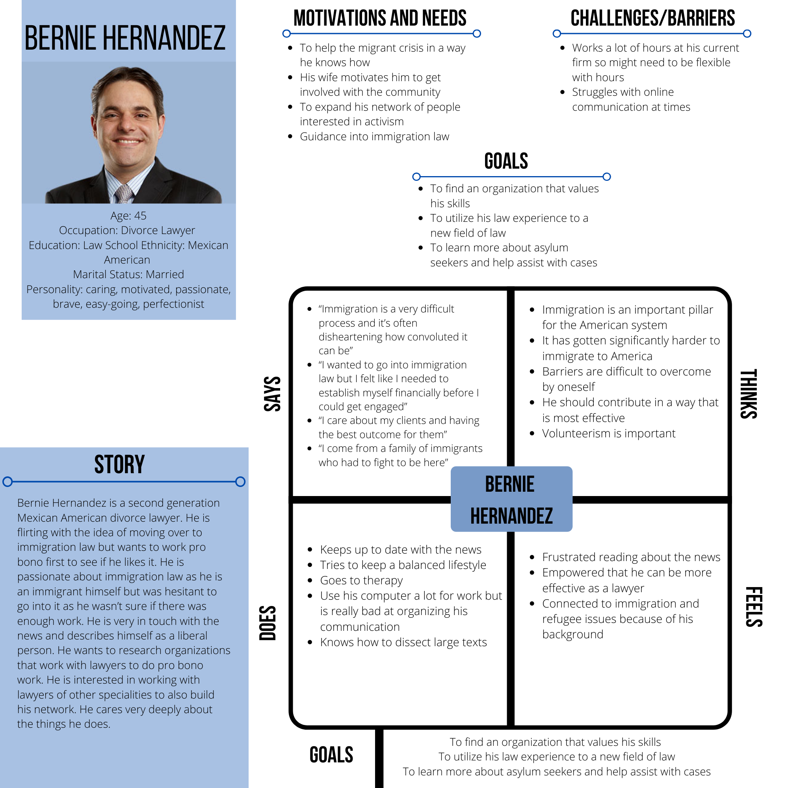

# DH 150: Assignment 5 
# The Advocates for Human Rights User Persona and Cases by Marina Souliman 

## UX Storytelling
Insert paragraph 

## Persona and Empathy Maps 

## Bernie 

## Jacob
 

## Julie 

## Scenarios and Journey Maps 
### Scenario 1 
Bernie is a divorce lawyer who is trying to find pro bono opportunities in immigration law as he wants to transition to that specialization. He is passionate about immigration rights and wants to volunteer at a non-profit helping connect lawyers and clients. He is looking for information about the process as well as the experience from lawyers who have worked with the organization. Bernie is not in a rush to explore his options and would rather take his time. It’s very important to him that he feels like he will be able to make an impact with the help of the organization. 

User case: Bernie opens up the website and scrolls for a little bit. He is unsure where the  opportunity for attorneys would be. He finds the volunteer tab and realizes the attorneys page is also under the volunteering tab. He is searching for attorney related positions and finds an overall landing page titled “Attorney Volunteer Opportunity.” He clicks on it and sees that there are two different types of representation he can look into: Asylum Attorneys and Bond Representation Attorneys. He reads about the information and finds that he wants to work as an Asylum Attorney. He sees there is a contact page for the coordinator if he has any questions and he makes note of it. Interested in what resources are offered, Bernie clicks on the resources tab and sees that they offer a variety of training resources. He is satisfied with the resources provided. He fills in the volunteer form and submits it to the website. 

