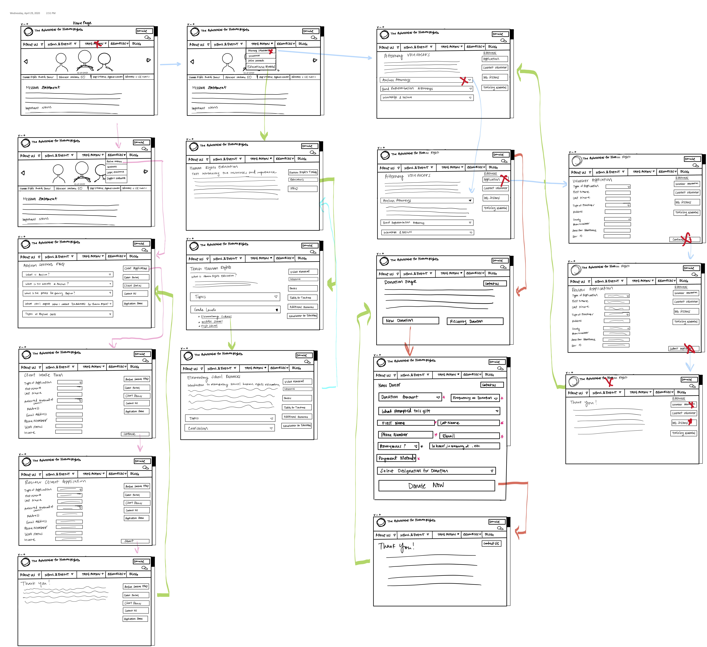
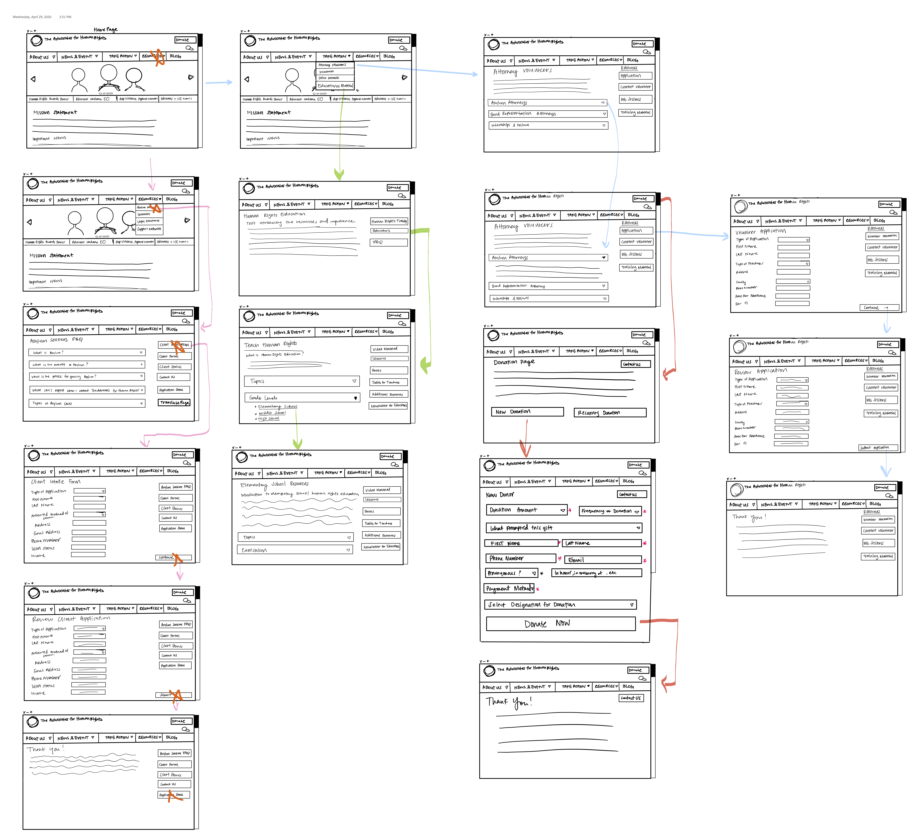
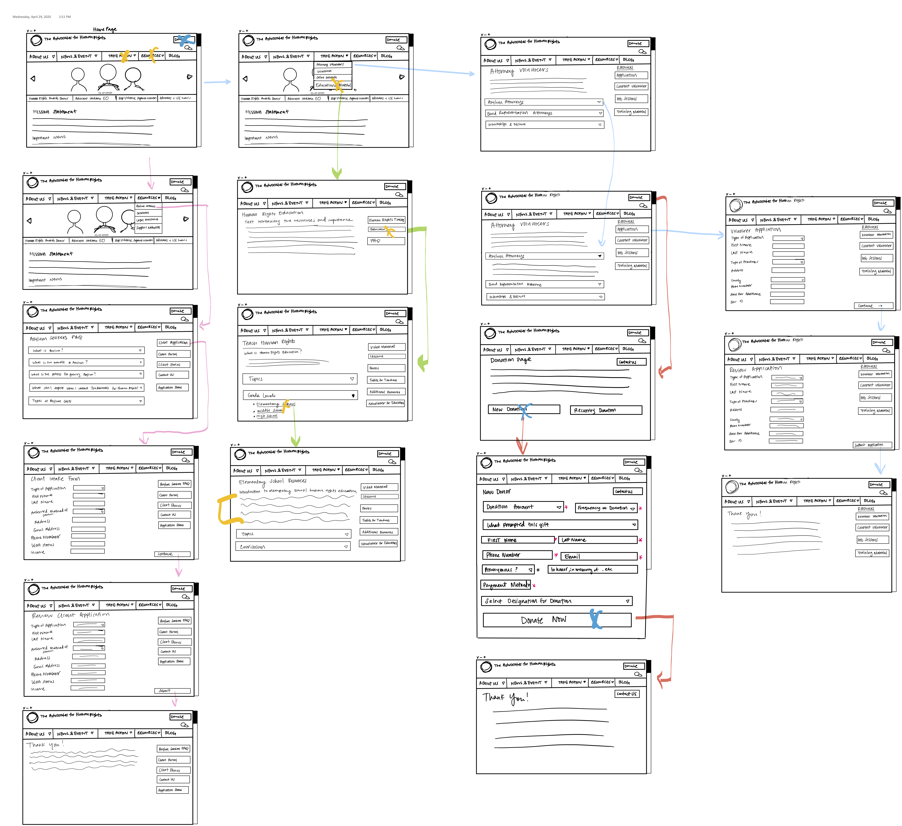
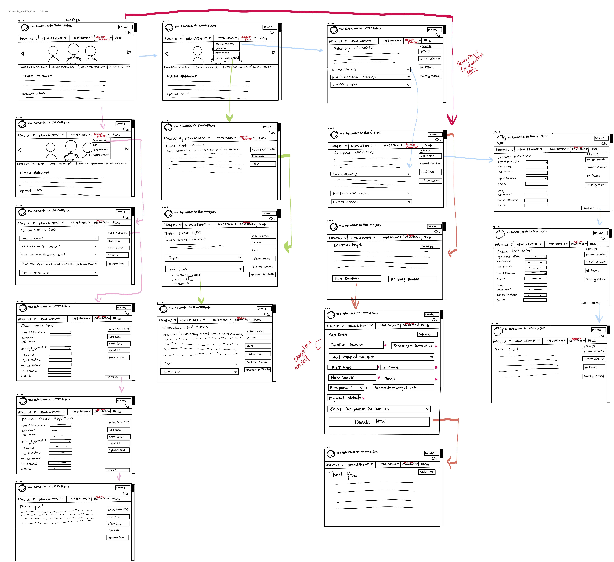

# Assignment 6: Advocates for Human Rights Low Fidelity Wireflow by Marina Souliman 

## Description of Project and Purpose 
This project is meant to help ease the user’s ability to navigate the Advocates for Human Rights website. The website is difficult to navigate at times as it’s wordy and not appropriately organized. The purpose of this low-fidelity prototyping is to get input from a user about how they navigate the redesigned elements and how to improve on them. I had a variety of personas focused on capturing who might visit the website. The first persona was a middle aged divorce lawyer, Bernie, who wanted to get involved with immigration law. He was tasked with finding information regarding how to become an Attorney volunteer and filling out the intake form. The second persona I used was that of Jacob, an Egyptian asylum seeker, seeking legal services. He was tasked with finding the intake form and finding more information about asylum seekers. Finally, the third persona is that of Julie, a new teacher looking to get involved with her community and find educational material to engage her students. I focused on these tasks because they’re central to the usability of the website. 

I created my prototype on my iPad and had my user interact with it using an Apple Pencil. My prototype supports four total tasks essential to the website’s function and the organization’s services. The user was asked to 
- Apply to be a volunteer asylum attorney 
- Apply for legal services as an asylum seeker 
- Find educational material for schools/outreach 
- Donate money to the organization 

## User Testing 

The user was able to complete all of the tasks. He had difficulty with the fourth task but ultimately completed it. Below is the original prototype of the wireflow. The tasks are listed below and the interaction of the user with the wireflow is marked with X marks. 

## Prototype:

### Task 1: 

### Task 2: 

### Task 3 and 4: 

## Reflection: 

For the first task, the user knew to go to the take action button when asked about volunteering initiatives. I was worried that they would go under resources but I think the word take action is used both on their website and is a good menu word. They followed the flow of information well and noted if they wanted to go to the home page they would just go to the logo to go back to the homepage which is intuitive to most users. For the second task, the user didn’t make note of the translate button on the asylum seeker resources page. I think moving it to the top right corner of the entire webpage and making stand out would be extremely helpful to users who need it. Placing it with the rest of the buttons probably made it not noticeable. Logistically speaking I think those seeking services for asylum seekers would only need the pages pertaining to them to be translated but I think having the entire website translated or having that opportunity would be a better use of accessibility. Other than that, the user was able to finish the task. For the third task, the user had some trouble finding the educational material. The user went to menu option Resources to find the educational materials. He realized it’s not under resources and went back. I would move the educational materials from the Take Action button to the Resources tab. I would do that in order to better categorize the words. I’m trying to find terms that encompass the resources menu tab and the take action tab that doesn’t sound too repetitive. For the fourth task, the user faced some issues with regards to the donation page in terms of the wireflow because of an error I made. He was confused as to where the next page after clicking the donation button was because the wireframe wasn’t placed properly after the home page. After that the user was able to get through the tasks and followed the interaction. He said that he would prefer to have the donation amount option as a regular text box rather than a dropdown to give freedom. I think that’s a very good suggestion in terms of having more flexible options for the user so I will be implementing a text input feature rather than a drop down. I thought originally having a drop down might be helpful in terms of preventing user error but there are other ways such as error or warning messages to help prevent that type of error from occurring. 

Overall, I think the prototype test went well. The user was able to completely finish all the tasks and only faced trouble with the last task. I did not intend to originally include the final task but decided to add it in. However, I did not integrate it as well as I should have from the home page. The user was able to find it once he looked at the other wireframes and from there the task went smoothly. I asked the user to speak out loud while he did this testing in order for me to hear his though process. It’s very close to how I thought the series of interactions would go but it was really eye opening to see how people go through the interactions using a paper prototype. Although this was useful in seeing that my interactions made sense, I think it would be useful to test it on the users it actually is meant to service whether that be volunteers, lawyers or asylum seekers. I want to know how different users have different levels of intuitive use. While making the wireflow, I looked at the pages they had and tried to figure out how to best consolidate the information and numerous hyperlinks whilst also communicating system visibility to the user. I think the issue with the original design of the website is that it had so much information on one page it was difficult to navigate so I’m attempting to consolidate information in a sidebar of buttons to help break down information. I had a hard time figuring out how to showcase the exit, cancel and other types of interactions on the wireflow because I think for websites it’s typically intuitive to use the arrows on the top left portion of the screen to go back and forth so I think going forward I’d like to figure out how to do that in a better way. 

## Revised Wireflow: 

 
