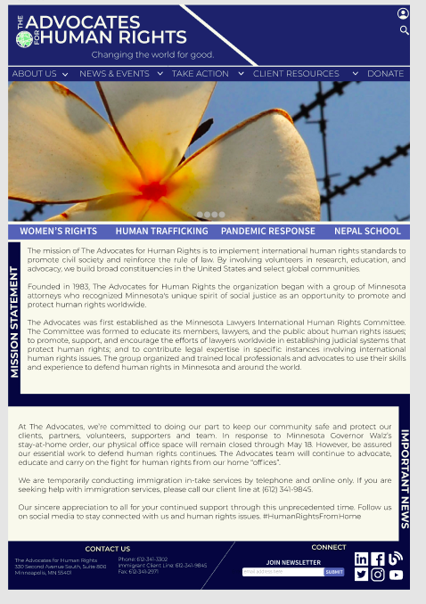
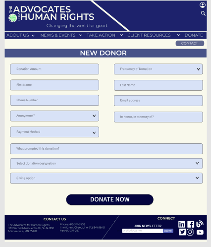
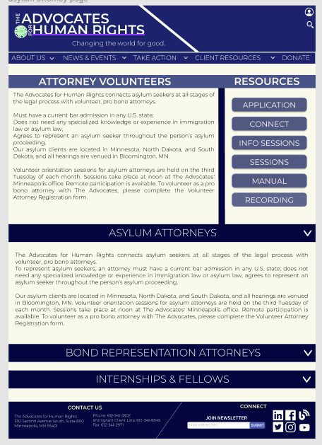
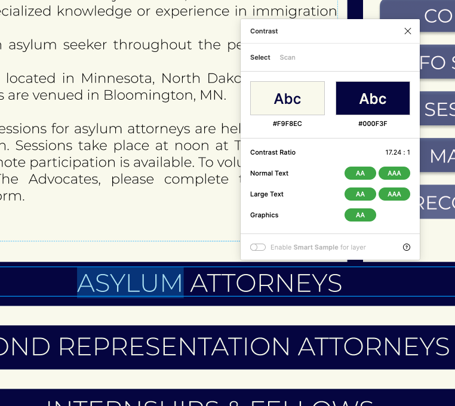
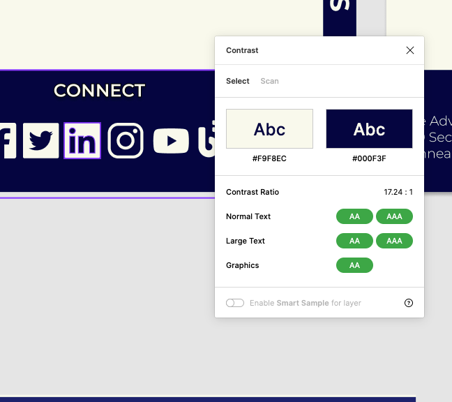
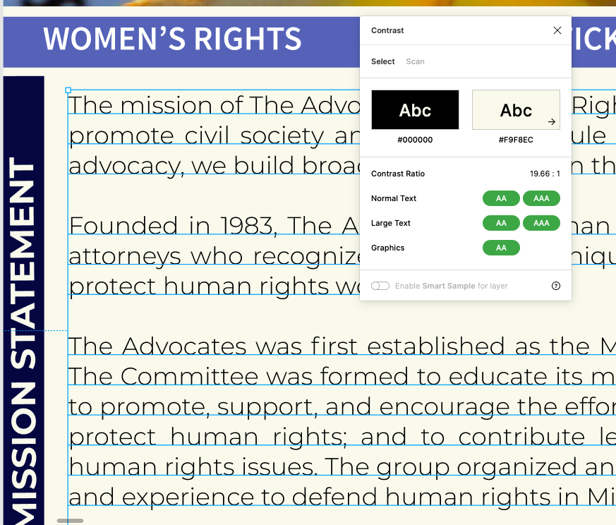
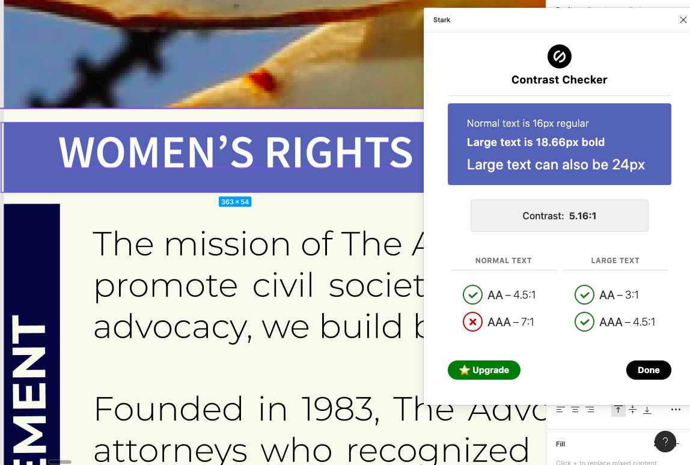
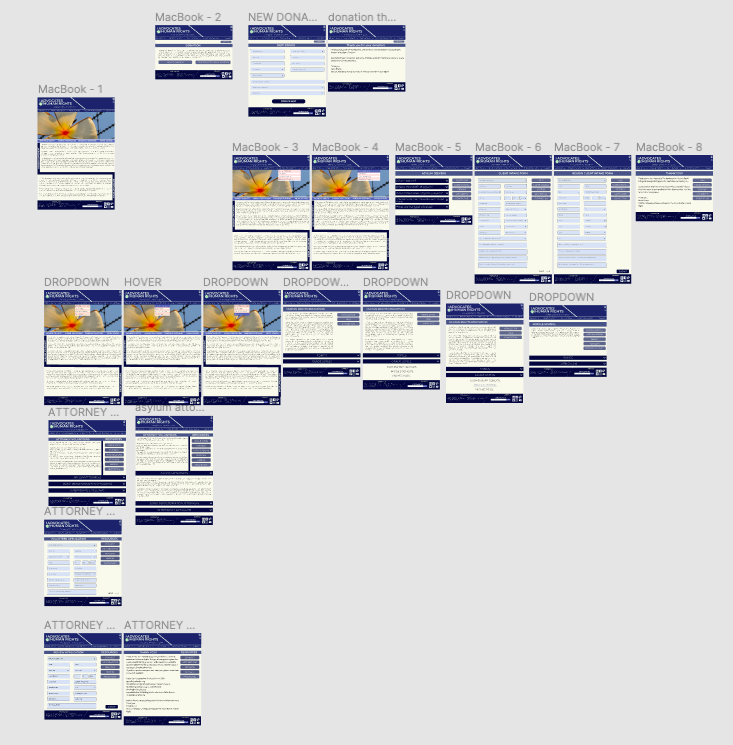
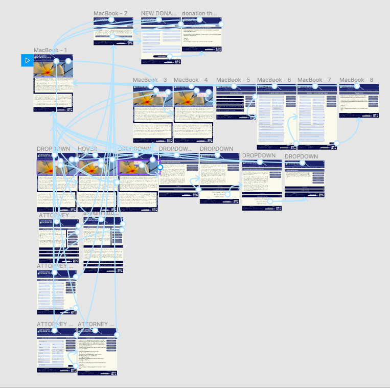

# DH 150: High Fidelity Prototype 

## Description of Project 
This project is a high fidelity prototype of the Advocates of Human Rights website created on Figma. The Advocates for Human Rights is an organization that focuses on volunteering within the realm of refugee and asylum issues. The organization provides a variety of resources to refugee and asylum seekers such as legal services, educational material and support networks. This prototype was created to better showcase the functionality of three tasks and three personas, Bernie Hernandez, Jacob Solomon and Julie Lee. The three tasks are filling out  a volunteer application, making a donation to the organization, filling out a client intake form and finding educational materials. The high fidelity prototype was adapted from a low fidelity prototype and used UI principles, color and typography to improve upon the design. 

## Interactions for tasks 

The first task is based off of the persona of Bernie Hernandez looking to join the organization as an attorney representative. The sequence of interactions goes from the home page and find the take action button that insinuates volunteer options. The user then clicks on the attorney volunteers option in the drop down menu and the respective volunteer page shows up. The user explores the volunteer opportunity they’re interested in and proceeds to fill out the application. The user then reviews the information they inputted and are greeted with a thank you page that gives them more information how to proceed. The second task is based on Jacob Solomon who is looking to learn more about seeking asylum and wants to find legal aid from the organization. First the user goes to the home page and then the Client Resources page and clicks on the Asylum resources page as he is seeking asylum. He then researches the topic a bit more on the page and clicks on the client application button. This takes him to the application page that he fills out. He then reviews the information and submits the application and is greeted with a thank you page that suggests different resources and more information on what to expect. The third task is based off of the Julie Lee persona who is meant to find educational material to introduce to her middle school students. First the user starts at the home page and navigates to the take action dropdown menu. She finds the education tab and clicks on it. This leads to a page introducing a landing page for human rights education and she then proceeds to find resources based on the age group of her students. 

I have a fourth task not based on a persona but it is something I wanted to include because it’s integral to the organization’s function. I wanted to improve the way the donate sequence of interactions for users and organize it. The user goes to the donate button on the home page. They then choose between a new donation or a recurring donation. Assuming the user is a new donor, they click on the appropriate button. They then fill out their application and review their inputs when they resume to the next page. They then submit the application and are greeted with a thank you page. 

## Graphical User Interface 

 

 

In creating the web pages, I wanted to employ a simple and monochromatic color scheme. The original website has a lot of clashing colors that distract from the information on the webpage so I wanted to use a color that wouldn’t be too bright or overwhelming so I chose a blue color scheme due to its cool tones. A lot of the changes I made for the website were organizational as the original website was extremely text heavy and relied on hyperlinks. I grouped resources into their respective buttons to ensure that the user doesn’t miss any crucial information in the text heavy website. I also introduced drop down features for text heavy portions of the website so that there’s segmentation between information. I also changed the font and made the background color less pigmented. I also reorganized the header and the foot bar of the website. I made the logo for the organization more uniform and made it larger to improve visibility and I also decreased the amount of things placed in the top right to reduce clutter. The things I did keep for the header bar were made into icons or buttons. The foot bar was changed to match the color of the header and grouped the information together. Throughout the website I used different iterations of the Monterresat and Source Sans Pro fonts and maintained consistency in their usage throughout the website. I changed the drop down menu to be more concise and have less options to avoid repetition of information. I found that a lot of redesigning the website was based on decreasing moments of repetitive information and figuring out ways to present information in a more digestible and navigation-friendly way. 

## Impression Test 
I conducted the impression test during class time and was able to get feedback from my peers. I wanted to get more feedback so I was able to receive feedback from the user who initially did my user testing for the website. 
What do you see?
The logo for the website is the first thing I see and the image in the middle of the page. I also saw the headers for the menu. Big text font. 
Some of the notes from our class feedback when asked about what do they see: “mission statement, image, headings, words and headings, mission statement on the home page, drop down”
 
They correctly guessed that the website is involving human rights and is based on an organization that has “volunteer, take action and asylum resources.”  Some comments for the impression test were regarding the home page as reviewers said they “like the bar and that it breaks up the two sections.”

Overall this was helpful to understand what people’s attention is first drawn to. I think it’s really helpful to also see what people’s thoughts are when they haven’t seen the project before and see if I maintained a good carryover for the website’s message in the redesign. 
 
## Accessibility 
I checked several aspects of contrast and made sure they were atleast AA compliant through Figma plugins Spark and Contrast. I found the old website hard to read because of the text and background color contrast so I wanted to make sure that I used larger text and kept contrast in mind. 

 
## Prototype Screens and Wireflow 
Link to Prototype: https://www.figma.com/proto/Eiwy9laoXcN0HVvo19ezLa/Advocates-for-Human-Rights-Copy?node-id=89%3A1&scaling=min-zoom 

Screen recording of prototype interactions: https://drive.google.com/open?id=1dFSh6m3zegrVkp3GQNC9QSgwk2esf_Yj 

### Representative Screen Designs 

### Wireflow with Graphic Designs 

### Cognitive Walkthrough 
 
During the class feedback we also did a cognitive walkthrough exercise. Although my prototype wasn’t as advanced as the complete version I had one of the tasks completed and was able to get feedback through that. I found that feedback still incredibly helpful.
Reviewers said the interaction point from going to the take action to attorney volunteer was “Pretty straight forward” and that progress in their tasks can be seen through the interaction points. When asked about any inconsistencies they reported no consistencies so far. A comment they gave was related to how I used space in the page and to play around with my text spacings. 
The cognitive walkthrough was helpful in seeing what was going right. I think it was also helpful in talking with others about how intuitive the interaction points felt. The comment about spacing was helpful as well and gaining confidence in what I had done so far was very good as I had done multiple revisions at that point. 
 
## Reflection 
The design process was frustrating at first and I spent a few hours just trying to feel comfortable with Figma first. I think my design was too closely tied to the original website so I found myself changing it from my low fidelity prototype. After I got comfortable with Figma it was a lot easier to navigate my design but I still struggled with the prototyping process as it got a little convoluted with many screens. I enjoyed the process overall and I think building the website thoroughly would be a good way to improve further on the UX design for other features. Although I’m sure my design can be further improved a lot because it’s not necessarily a functioning model of the site and as other things are implemented there might be clashes, I think I definitely managed to improve on some things from the original website. 
I think I’d like to do more cognitive walkthroughs with my other tasks and see how I can improve or if there are any issues I didn’t catch. Ideally I want to use more color throughout the website and find a good balance but I also would like to get pictures relating to the organization which weren’t readily available so I had to use the filler picture on the website. I think using more graphics would’ve been ideal but the organization doesn’t employ a lot of graphics or have many on the website that I can adapt. Using different forms of media would elevate the website’s design as well as introduce information in a greater variety of mediums. 

## Revisions 

