# Human Rights Advocacy   

## DH150 Assignment 1: Heuristic Evaluation by Marina Souliman
Education is the key to social change. Many nonprofit organizations work to educate the public and get them involved with enacting tangible change. Through comprehensive and easy to use websites, users can learn more during their visit and can be more engaged with the educational material. Becoming educated about human rights issues around the world is the first step in understanding how we can help. Human rights nonprofit organizations typically have two focuses: educating the public and providing services and resources to those effected. The first organization I want to focus on is Human Rights First which focuses on advocacy for American ideals through a similar approach. They provide services and have been well established for sometime in their adovcacy efforts. The second organization I want to explore is the Advocates for Human Rights as their website offers educational material as well as a variety of resources and services. By improving the design of this website and making it more user friendly, it will aid both in relaying their educational material better and making the website easy to use for those seeking their legal services. Both of these websites are used to educate the public to bring awareness about a variety of issues but has a strong emphasis on refugee and immigrant rights. As both of them offer legal services to refugees and those seeking asylum, I personally find it a worthwhile effort to try to improve the usability of the websites as the information provided by these organizations is important to changing people's lives. America used to be a safe haven for those suffering but seeking asylum status or immigrating to America has become more difficult with the current administration. With my heuristic evaluation I hope to set out to discover ways to make their websites better for users interested in exploring these nonprofit organizations and their cause as well to those seeking out the legal services. 

## Heuristic Evaluation Severity Scale 

1 = Cosmetic problem only: need not be fixed unless extra time is available on project

2 = Minor usability problem: fixing this should be given low priority

3 = Major usability problem: important to fix, so should be given high priority

## Website 1: Human Rights First 
https://www.humanrightsfirst.org/

The Human Rights First website starts at the home page with a heading bar that allows for a user to navigate through an about page, campaigns, topics, resources, media and vets for american ideals. Below that is a slideshow type graphic that offers a look at their initiatives and events. There are a lot of resources and services offered on this website for both the general public and those seeking legal services. 
 
The website is functional and works well but has some UX issues that could help improve usability. It’s often at times overwhelming with a lot of text and has a design that could be more cohesive with a better flow for information. There are some features that feel outdated and could be designed in a more appealing manner. Having a more user friendly website will help users engage with the material more and more importantly it will be easier for those seeking services. Overall, it’s a functional website that could use a little bit of sprucing up when it comes to certain features I will discuss later in the heuristic evaluation. 

### 1: Visibility System of Status
There should be an indication to the user that the menu bar can be expanded for example an arrow or some sort of indicator. The resources page does not expand like the others so a user might hover over it and wait to see if it expands. **(1)**

Throughout the website, there are indicators that the user has selected an option whether it be changing the color of the item. This informs the user that their interaction with the system worked and is a good use of this heuristic. Overall, there are consistent indicators for the user that helps support the visibility of system status with very minimal issues.  

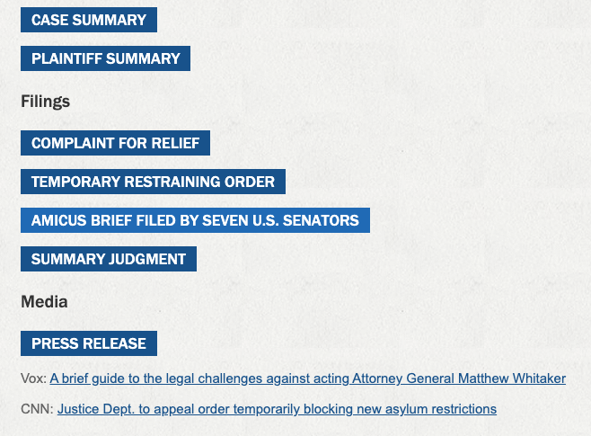

### 2: Match between system and the real world 

An issue could be seen with the calendar where they have events from previous years. When someone thinks of events, they think of upcoming events and may be misled if they saw events from last year. This doesn’t follow common conventions for event pages and an alternative method for showcasing previous events should be explored. It's important to make a clear distinction between current events and archived events so as to avoid confusion for the user. **(2)** 

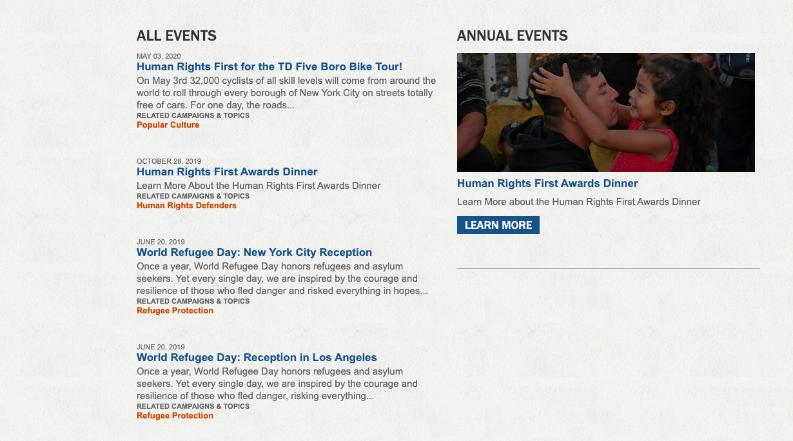

Overall there's a good match between the system and real world concepts. The search function works well and as expected. There's a common addition throughout the website that has icons for social media that allows the user to make the connection between the icon and the social media. With the exception of the events page, there's not much difficulty for the user in matching certain elements between the system and the real world. 

### 3: User Control and Freedom 
If a user clicks on the search button on the top right corner on accident without searching any terms it takes them to the search page. It should not take a user to a different page if they have not searched any items as it can be assumed if they clicked on the icon without writing anything in the search bar it was by mistake. There's no "emergency exit" as well. Making a condition where if the user doesn't input any search keywords but clicks the search icon, they shouldn't be removed from the current page is helpful in fixing this issue. **(2)**

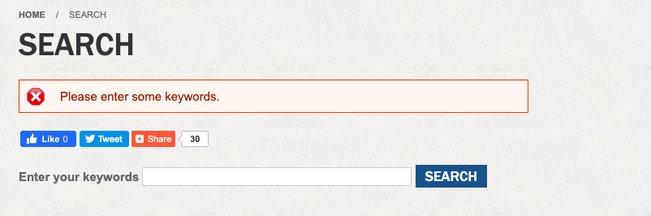

The website has clickable social media icons that change the current page a user is on to the respective social media website. I think opening a new tab instead of changing the current user’s page gives the user more freedom to browse between the website and the social media website. **(2)**

If you click on the Vets for American Ideals, it takes you to a new webpage for a different organization. This is misleading to the user as it’s placed with other elements of the website. **(3)**

An issue with the user control and freedom heuristic can be seen with links that exit out of the webpage without the user expecting it to do so. Having the link open in a new window might be beneficial in giving the user more freedom with going back and forth between the webpages. 

### 4: Consistency and Standards
At the bottom of the webpage there is a sign up button next to the asylum and donate button. Sign up buttons are typically on the top right corner and it would probably be more visible to the user if it was there. This is inconsistent with the conventions of most websites and probably decreases the likelihood for a user to find the appropriate button. **(2)**

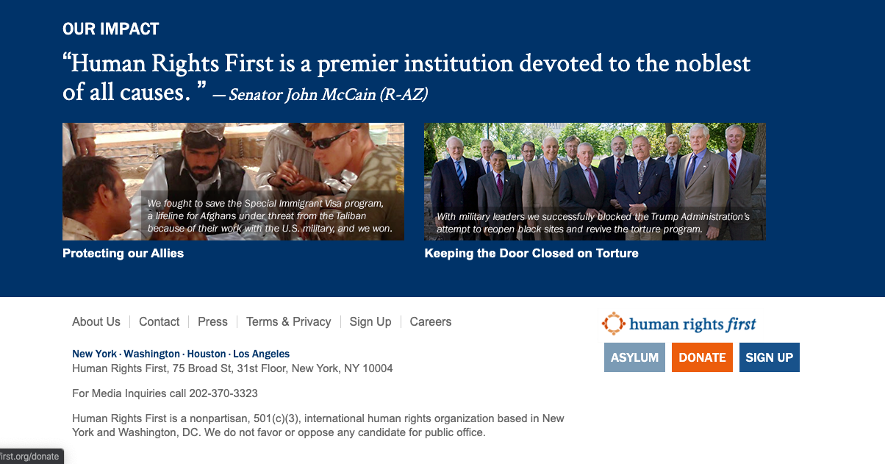

Furthermore, there are inconsistencies within the website itself. The sign up button and the Take action button are both third on the list of buttons shown below. This may confuse the user that they are the same action when in fact they are not. They should keep it consistent. Ths is further an issue because the Sign Up action and Take Action might be considered the same to a user and therefore there must be a clear distinction in design for the buttons. **(3)**

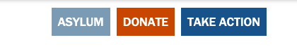
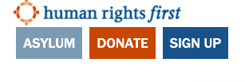

### 5: Error Prevention 
If a user enters the wrong spelling for their email engine there is no warning given and the error is not prevented. In fact, it allows the user to continue on and makes it so they have signed up to the mailing server. The user would not know that they made this error and therefore would wrongfully believe that they were signed up to the mailing list. This is a crucial error for a nonprofit organization that relies on newsletters to get their information out to users. **(3)**

 
### 6: Recognition rather than recall
 
The website is very good at categorizing the articles under the specific campaigns or categories so users don’t need to remember what campaign they were looking at. This is an example of good use of the hueristic.

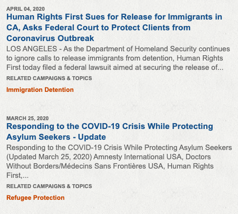

On every page there’s a navigation tool that shows the user where they are in the website. Although this is helpful for decreasing the user’s memory load, it feels like repeated information as the same navigation tool is available in the menu. This screenshot shows that there’s a bar above the article title that says “Home/Campaigns/Title of the Article.” **(2)**

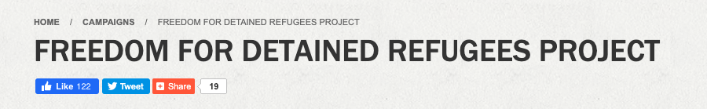

The website has good uses for recognition over recall as seen with the categorizing for the articles but there are some features such as the navigation tool that is overly reliant on recognition. 
 
### 7: Flexibility and efficiency of use 
An accelerator that is very common among websites is allowing the logo for the website to take the user to the home. This is seen on many websites and a good use of this heuristic is seen in through providing a clickable logo to take the user to the home page. 

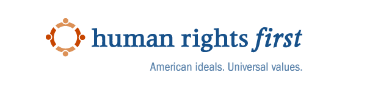

These are also considered accelerators that allow the user to go quickly to the social media website. This is a fast way to get to the websites and is available to the user at all times. This allows for more flexible use in terms of finding the social media for the organization. However, there's a difficulty that comes with having those social media icons readily available where the user may accidentally click on it. Having a social media tab in the menu might benefit the flexibility without having an effect on the usability **(2)**

 
### 8: Aesthetic and minimalist design 
The website is very text heavy on the media press releases page and has a lot of information going on. I think providing an article headline and a date to the press release is a more aesthetic design. I personally found the text heavy links very overwhelming and it stopped me from exploring that page. Utilizing more design features that separate text easily would benefit disseminating the information. **(3)**

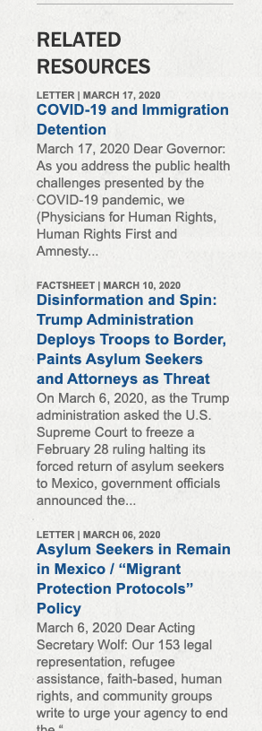

The home page has a red bar that has a message regarding American rights advocacy and it feels very imposing on the page. It leads to a scroll like message with imagery that’s meant to capture the organization’s mission statement. Although this is unique to the organization, the scroll feature makes the imagery slightly disconnected. **(1)**

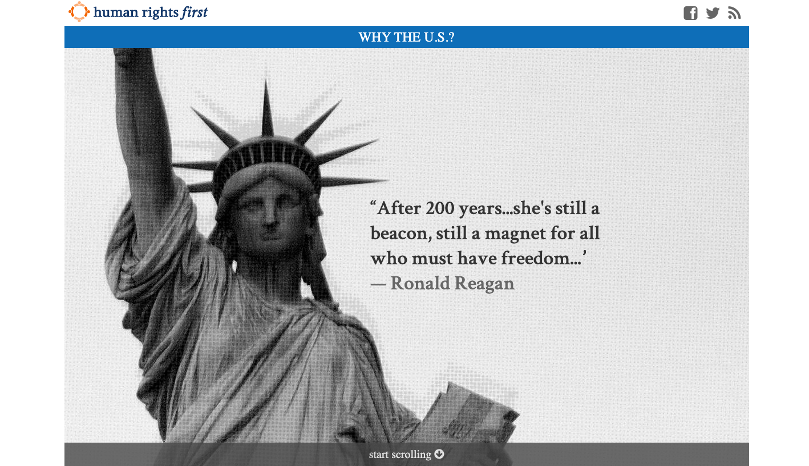

On every page there is a share link bar that can feel fairly imposing at times and is even visible for the search page which isn’t necessarily something a user is likely to share, making it just an unnecessary element on the page. **(1)**

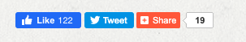
 
### 9: Help users recognize, diagnose and recover from errors
If a user inputs a nonexistent address, it provides the user with an input error that specifies that the address was the incorrect input. This is fairly good as it provides the user with a specific error they can fix. 

If there’s an incorrect search term, the search offers an error and helps the user figure out what the issue is. 
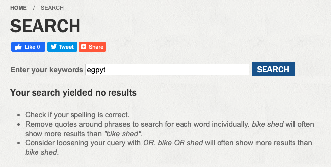

There are pretty good measures when it comes to helping users fix errors with text that's coherent and clear. More importantly, there aren't a lot of points where users can make errors and where there are, the website does not disappoint in providing detailed instructions.
 
### 10: Help and documentation 
This FAQ page can be improved in terms of design as it just offers a list of questions and a very wordy documentation. It could be improved in terms of size by having the questions serve as a clickable and expandable feature. This would decrease how long it takes to go through the page and can help the user pick the appropriate question without having to go through a lot of information. **(2)**
 
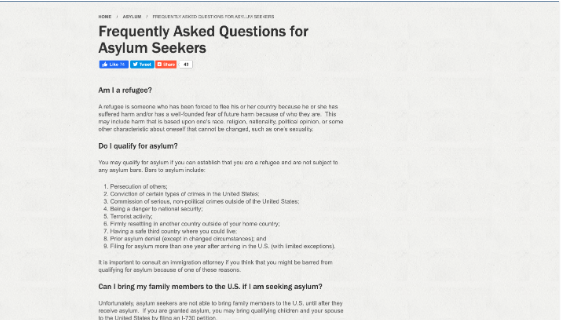

## Website 2: The Advocates for Human Rights 

https://www.theadvocatesforhumanrights.org/

The second website I'm analyzing is The Advocates for Human Rights. Similar to the previous website, there's a home page with a navigation toolbar near the top. It helps users navigate through the pages in a categorized way. The majority of the content is heavily centered in the middle of the page. The text is very basic and there are not many visuals or images provided on the website with the exception of three or four images. The website is very basic but is extremely text heavy. It's difficult to navigate at times because of at times clunky design and because it doesn't utilize the entire webpage it feels very crowded. 

There are a lot of places where improvement can occur for the sake of the usability. Overall, using more design elements to separate the text and effectively relay the information is essential in improving usability. Consolidating certain elements and webpages would be very helpful in having a more minimalist design that is easier to navigate. Utilizing the entire space provided on the webpage in an organized manner would make the website a lot easier to use. 

### 1: Visibility System of Status
On the sidebar to the left, there are categorized quick links. When you hover over them there’s no indication that it’s being selected. This is inconsistent with the rest of the website as when you over other links they’re often underlined or change color. Fixing this would be helpful in improving the visibility system of status. **(2)**

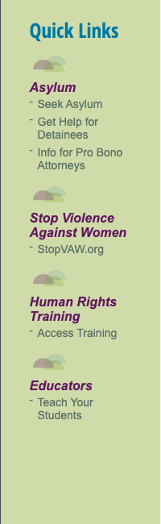

On the quicklinks page, there’s a link to a sub-organization focused on violence against women. This takes you to a completely different website with no warning. There's no clear indication it does that and is an unexpected action the user may not anticipate. **(1)**

### 2: Match between system and the real world
Like many websites, this website offers a search option. It’s just marked as a simple box with the word search next to it which works and follows a lot of the same standards as other websites. They can rely on their previous experiences with searching for things and assign them to the same search element on the website.  

The website also utilizes social media icons to represent links that lead to the respective social media website. This is easy to use and recognizable to the user because of their previous experience with social media. 

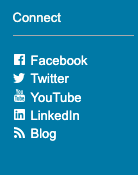

There aren't a lot of apparent issues with matching the system and the real world as it follows common world concepts. Therefore, this heuristic is pretty well established within this website.

### 3: User Control and Freedom
When a user searches something in the search bar, it takes them to a google search window that is separate from the website. There’s no undo button except for the regular web browser button. There is no expectation that the webpage would take it to a Google search and no way provided by the website itself to exit, making it a violation of the user’s control. **(3)**

This is an important issue to fix as it takes the user to a completely different site and doesn't support their ability to freely utilize the webpage and takes away some level of control from them. 

### 4: Consistency and Standards
These two actions serve very similar purposes but can be confusing to the user as the phrasing “Take Action” is vague. The links underneath Take Action could be provided under Volunteer as a subsection. Consolidating these two pages or making a more clear distinction could benefit consistency. **(3)**

The navigation bar has a Blog option but under news and events there’s an E-news option that has no further explanation. The user does not know if the blog and e-news are the same options and thus this is inconsistent. These are three options given to the user without much clarification as to what any of them really entail when they choose the option. 

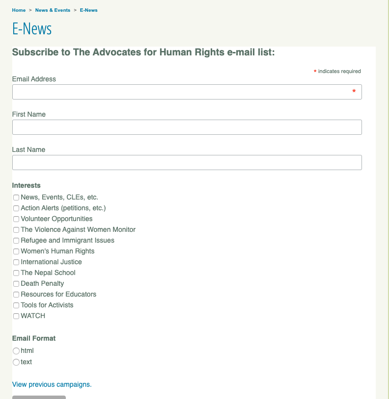

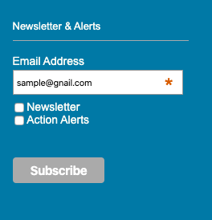

### 5: Error Prevention

The search option offers no auto-suggestion or method of preventing users from making search mistakes. It would be helpful to see auto suggestions for search items a user is looking up depending on more frequently searched terms. **(2)**

In terms of error prevention, where there is potential to make an error, the system warns the user. For example, when a user mispells a search engine, they tell their user that the there's an issue with the email. 

### 6: Recognition rather than recall
When clicking the donate button, there’s an option for the user to log in. However there is no clear place where a user is prompted to create an account if they’re a new user. It’s not a visible option and thus user must actively search to find a way to make an account. **(2)**

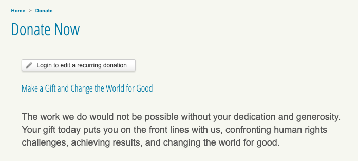

The donate button is very apparent as when you’re on any page, there are three options available for you to donate. This is helpful in terms of the recognition heuristic but it feels like it is an overused heurisitc that may affect the usability of the website. **(2)**

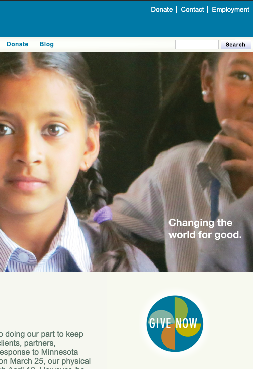

### 7: Flexibility and efficiency of use 
Each overview page has a reiteration of what topics/subsections are provided. There are also hyperlinks that lead the user to the appropriate page. This is consistent throughout the website and can speeds up a user’s ability to reach specific topics. These subsections are provided as well under the top menu and also serves an accelerator to finding the appropriate topic. 

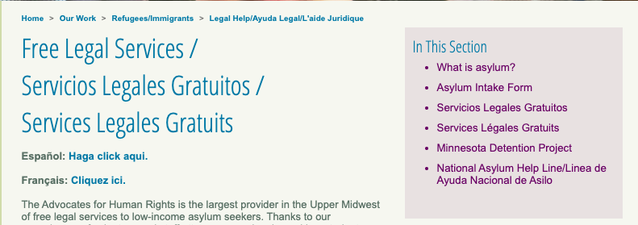

There’s a plugin calendar provided on the events page. This allows the user to see what events are happening that month. There aren’t many events so the calendar is mostly empty space and doesn’t inform the user of much as it cuts off the information. Underneath the calendar are the descriptions but they are disorganized and are not cohesive. **(3)**

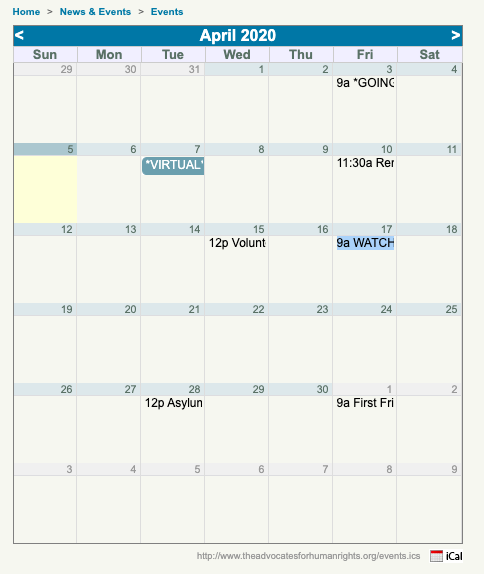

This website has a common accelerator where if you click on the logo it will lead to the home page. However, this is inconsistent and doesn’t work when you try to exit out of the donate page. **(2)**

### 8: Aesthetic and minimalist design
The website has a lot of text information in a very small space so it makes it feel overwhelming to the user. The design feels busy and somewhat frustrating to use. The website has two color columns on either side of the website that don’t serve any purpose and just take up space. Utilizing the entirety of the space could be immensely beneficial to the usability of the website and organization. **(3)**

These two actions are right next to each other and offer very similar information. Consolidating it underneath one label would help declutter the design. **(2)**

### 9: Help users recognize, diagnose and recover from errors
The website has a nonspecific message for the user when they enter an incorrect email and password combo. Furthermore, although I do not have an account made it’s not stating there’s no account of that nature. A more descriptive error message would be helpful in users recognize the issue. **(2)**

If a user types a wrong email so for example writes gnail instead of gmail, there’s an indication you made an error and it has an informative error message. 

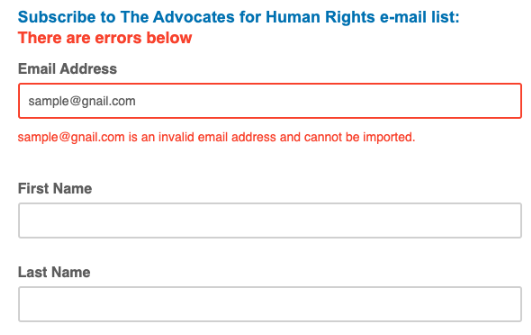

### 10: Help and documentation
There are not many documentation options but there’s a FAQ for internships provided by the organization. I think it’s very text heavy and hard to navigate because of that. A more user friendly approach to FAQs could utilize a click to see the response to the question option. **(2)**

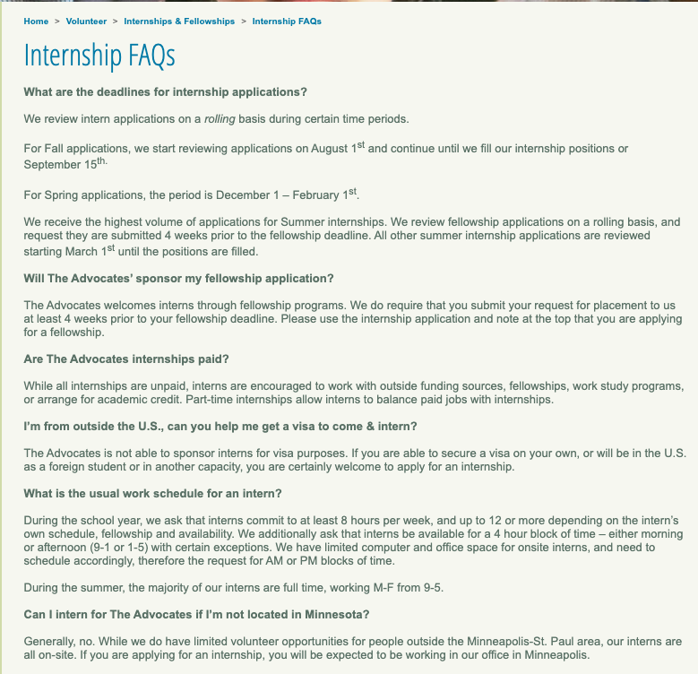
